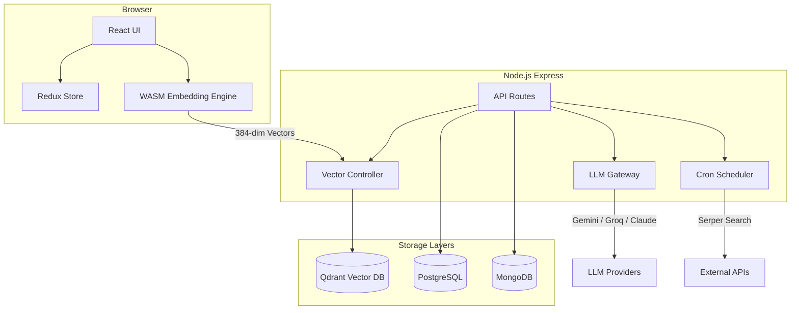

# ⚡ Pulse — The AI Co-founder You've Always Wanted

> Pulse is a high-stakes AI advisory platform designed specifically for startup founders. It doesn't just chat; it tracks your commitments, monitors your competitors, and lives within your data to hold you accountable.

---

## 🚀 The Vision

In the chaotic early days of a startup, founders often lack a true peer who knows their journey as well as they do. **Pulse** (internally "Life Co-founder") fills this gap by ingesting your entire professional identity—from GitHub commits to LinkedIn history and deep psychological self-reports—to build an AI partner that understands your blind spots, celebrates your wins, and calls out your failures with radical candor.

---

## ✨ Key Features

### 📂 3-Source Deep Ingestion
Pulse builds its brain by cross-referencing three critical data sources:
*   **LLM Self-Report**: A deep-dive psychological and professional survey.
*   **LinkedIn Profile**: Automated extraction of your professional milestones and network context.
*   **GitHub Activity**: Direct analysis of your technical output, languages, and star-power.

### 🧠 Dynamic Character Card
After ingestion, Pulse generates a unique "Character Card" that defines your founder persona. It tracks:
*   **North Star**: Your ultimate mission.
*   **Blind Spots**: Areas where you likely struggle.
*   **Tech Stack & Operating Style**: How you actually get things done.

### 🗣️ RAG-Powered Chat with Voice
*   **Context-Aware**: Uses Vector Search (Qdrant) to pull relevant snippets from your past data into every conversation.
*   **Voice Standups**: Supports browser-based speech recognition for quick daily updates.
*   **Voice Synthesis**: The co-founder speaks back to you using native browser synthesis.

### 🔁 Commitment Tracking (Open Loops)
Pulse automatically detects commitments made in chat (e.g., "I'll finish the landing page by Tuesday") and stores them as "Open Loops." It surfaces these in the sidebar to ensure nothing slips through the cracks.

### 🕵️ Competitive Intelligence
*   **Daily Cron Jobs**: Automated tracking of your competitors using Google Search (Serper).
*   **Urgency Ratings**: High-urgency competitive threats are injected directly into the chat header.

### ✉️ Gmail Integration
*   Connect your Gmail account via OAuth.
*   Draft, review, and send or schedule emails directly from the chat interface.

---

## 🛠️ Tech Stack

### Frontend
- **Framework**: React 19 + Vite 6
- **State Management**: Redux Toolkit
- **Styling**: Tailwind CSS 3
- **Embeddings**: `all-MiniLM-L6-v2` (Generated **in-browser** via WASM to preserve privacy and speed).

### Backend
- **Runtime**: Node.js (ESM) + Express 5
- **Vector DB**: Qdrant Cloud
- **SQL DB**: PostgreSQL (Neon Tech) for persistence (loops, intel, reminders).
- **NoSQL DB**: MongoDB for User Profiles and Agent Configuration.
- **LLMs**: Multi-provider support (Gemini 2.0 Flash, Llama 3.3 70B via Groq, Claude 3.5 Sonnet).

---

## 🏗️ Architecture



---

## ⚙️ Setup & Installation

### 1. Prerequisites
- **Node.js**: v18+
- **PostgreSQL**: A running instance (or Neon.tech URL)
- **MongoDB**: A running instance (local or Atlas)
- **Qdrant**: A Cloud cluster or local docker instance

### 2. Environment Variables
Create a `.env` file in the `server/` directory:

```env
PORT=3001
DATABASE_URL=your_postgres_url
MONGO_URI=your_mongo_url
QDRANT_URL=your_qdrant_url
QDRANT_API_KEY=your_key

# LLM Keys (Configure at least one)
GEMINI_API_KEY=
GROQ_API_KEY=
ANTHROPIC_API_KEY=
ACTIVE_MODEL=gemini

# Integrations
SERPER_API_KEY=your_serper_key
SESSION_SECRET=your_secret
JWT_SECRET=your_jwt_secret

# Optional Gmail (OAuth)
GMAIL_CLIENT_ID=
GMAIL_CLIENT_SECRET=
GMAIL_REDIRECT_URI=http://localhost:3001/api/agent-setup/gmail/callback
```

### 3. Installation
From the root directory:
```bash
npm install
```

### 4. Running the App
The project uses `npm workspaces` to run both client and server concurrently.

**Development mode:**
```bash
# Windows
./dev.bat

# Unix
./dev.sh

# Or directly via npm
npm run dev
```

The app will be available at:
- **Frontend**: [http://localhost:5173](http://localhost:5173)
- **Backend API**: [http://localhost:3001](http://localhost:3001)

---

## 🔄 Core Data Flow

1.  **Onboarding**: Founder submits raw professional text.
2.  **Vectorization**: The browser generates embeddings for text chunks using local WASM.
3.  **Storage**: Vectors are stored in Qdrant; SQL metadata is stored in Postgres.
4.  **Persona Synthesis**: An LLM analyzes the sampled data to create a "Character Card."
5.  **RAG Chat**: Every user message is embedded, matched against Qdrant, combined with "Open Loops" and "Competitor Intel," and sent to the LLM for an opinionated response.

---

## 📄 License
This project is private and proprietary. Copyright © 2026 Pulse Team.
