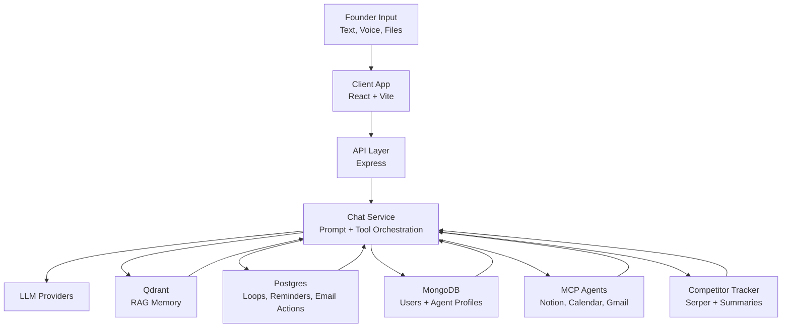

# Pulse - Personal Intelligence for Founders

Pulse is an AI operating layer for founders that turns conversations, context, and commitments into searchable memory, action, and accountability.

## Demo

Add your demo GIF here:

```md

```

## Features

- RAG-native founder memory across self-report, LinkedIn, GitHub, Notion, and chat context
- Open loop detection that tracks commitments and follows through on what you said you would do
- Competitor intel with daily monitoring and urgency-aware prompt injection
- Voice-first updates with transcription, memory capture, and spoken interaction
- MCP integrations for Notion, Google Calendar, and Gmail
- Email drafting, scheduling, reminders, and founder profile grounding

## Architecture



## Quick Start

```bash
git clone https://github.com/your-org/pulse.git
cd pulse
cp server/.env.example server/.env
npm install
npm run dev
```

Frontend runs on `http://localhost:5173`. Backend runs on `http://localhost:3001`.

## Environment Variables

Use [`server/.env.example`](./server/.env.example) as the source of truth. The table below covers the main variables you will actually configure.

| Variable | Required | Description | Where to get it |
| --- | --- | --- | --- |
| `PORT` | No | Express server port | Your hosting provider or local machine |
| `NODE_ENV` | No | Runtime mode | Node.js docs |
| `LOG_LEVEL` | No | Pino log verbosity | Pino docs |
| `SESSION_SECRET` | Yes | Express session signing secret | Password generator |
| `JWT_SECRET` | Yes | JWT signing secret | Password generator |
| `ACTIVE_MODEL` | No | Enabled model key from `server/config/models.js` | Your code config |
| `QDRANT_URL` | Yes | Qdrant cluster URL | [cloud.qdrant.io](https://cloud.qdrant.io) |
| `QDRANT_API_KEY` | Yes | Qdrant API key | [cloud.qdrant.io](https://cloud.qdrant.io) |
| `DATABASE_URL` | Yes | Postgres connection string | [neon.tech](https://neon.tech) |
| `MONGO_URI` | Yes | MongoDB connection string | [mongodb.com/cloud/atlas](https://www.mongodb.com/cloud/atlas) |
| `NVIDIA_API_KEY` | Yes | Embeddings, reranking, and default LLM access | [build.nvidia.com](https://build.nvidia.com) |
| `RERANKER_ENABLED` | No | Enables reranking in retrieval | NVIDIA NIM docs |
| `SERPER_API_KEY` | No | Competitor search API key | [serper.dev](https://serper.dev) |
| `TRACKER_USER_ID` | No | Founder user ID for scheduled competitor tracking | Your Pulse database |
| `MCP_ENABLED` | No | Enables MCP-based enrichment | [modelcontextprotocol.io](https://modelcontextprotocol.io) |
| `NOTION_API_KEY` | No | Notion MCP auth token | [notion.so/my-integrations](https://www.notion.so/my-integrations) |
| `GOOGLE_ACCESS_TOKEN` | No | Google Calendar MCP token | [console.cloud.google.com](https://console.cloud.google.com) |
| `GMAIL_ACCESS_TOKEN` | No | Gmail MCP token | [console.cloud.google.com](https://console.cloud.google.com) |
| `GMAIL_CLIENT_ID` | No | Gmail OAuth client ID | [console.cloud.google.com/apis/credentials](https://console.cloud.google.com/apis/credentials) |
| `GMAIL_CLIENT_SECRET` | No | Gmail OAuth client secret | [console.cloud.google.com/apis/credentials](https://console.cloud.google.com/apis/credentials) |
| `GMAIL_REDIRECT_URI` | No | OAuth callback URL | Google Cloud credentials page |
| `GMAIL_REFRESH_TOKEN` | No | Server-level Gmail fallback token | Your OAuth flow |
| `GMAIL_SENDER_EMAIL` | No | Default sender address | Gmail account tied to the token |

## Tech Stack

| Layer | Stack |
| --- | --- |
| Frontend | React, Vite, Tailwind CSS |
| Backend | Node.js, Express, Zod |
| Vector Memory | Qdrant |
| Relational Data | PostgreSQL |
| Document Data | MongoDB |
| Local Persistence | SQLite |
| LLM + Retrieval | NVIDIA NIM |
| Search | Serper |
| Integrations | MCP, Google APIs, Notion |
| DevOps | Docker, GitHub Actions |

## Contributing

1. Fork the repo and create a feature branch.
2. Copy `server/.env.example` to `server/.env` and configure local services.
3. Run `npm install`, `npm run lint`, and `npm test` before opening a PR.
4. Use the pull request template and include reproduction steps or screenshots when relevant.

## License

MIT. See [LICENSE](./LICENSE).
